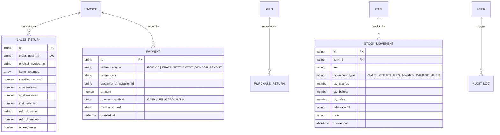

# Comprehensive Senior Developer System Audit & Bug Scan Report
**Project:** Retail POS & Billing System (PAVATI OS v2.0)  
**Date:** September 11, 2026  
**Auditor:** Antigravity Senior Staff Software Architect  
**Scope:** Complete Codebase Scan (Backend Node/MongoDB, Frontend React 19/Vite, Indian GST Compliance, Architecture & Data Integrity)

---

## 1. Executive Summary & System Health Matrix

| Domain | Status | Rating | Architectural Assessment |
|---|---|:---:|---|
| **Core POS & Billing** | 🟢 Operational | 9/10 | Fast barcode scan, cart management, dynamic UPI QR generation, A4 Tax Invoice + 80mm/58mm thermal printing are solid. |
| **Central GST Engine** | 🟢 Solid | 9.5/10 | Centralized `gstEngine.js` accurately implements Indian GST rules: intra-state (CGST + SGST) vs inter-state (IGST), inclusive/exclusive tax back/forward math, discount pro-rata apportionment, and round-off. |
| **Database & Cloud Atlas** | 🟢 Connected | 9/10 | MongoDB Atlas connection live, compound indexes configured, resilient auto-reconnect logic in place. |
| **Sales Returns & Credit Notes** | 🔴 Critical Bug | 2/10 | **CRITICAL FLAW:** `processReturn()` marks the entire original invoice as `returned`, destroying historical revenue records. Missing Credit Note generation, partial return support, and tax reversal ledger. |
| **Inward GRN & Purchase GST** | 🟡 Incomplete | 4/10 | GRN doesn't track per-item HSN/GST lines. GSTR-3B ITC reports use hardcoded fallback GSTIN and forward estimates. Missing Purchase Returns (Debit Notes). |
| **Cash Management (Shifts)** | 🟡 Schema Mismatch | 5/10 | `expected_cash` is calculated in code but stripped by Mongoose because it is omitted from `Shift.js` schema; no expense or cash refund deduction. |
| **Supplier & Customer Directory** | 🟡 Data Loss Bug | 4/10 | Vendor phone numbers are permanently lost on save due to a frontend/backend key mismatch (`contact` vs `phone`). Customer model lacks state/type fields. |
| **System Security & Auth** | 🔴 Unsecured | 1/10 | Zero authentication. Packages `bcryptjs` and `jsonwebtoken` installed but unused. All endpoints and database backups are completely public. |
| **Inventory Audit Trail** | 🟡 Direct Mutation | 3/10 | Stock changes occur via direct `$inc` operations with zero immutable movement logs. No audit trail for inventory shrinkage or adjustments. |

---

## 2. Critical Operational Bugs & Runtime Logic Flaws

### Bug 1: Sales Returns Mutates Original Invoice & Erases Revenue (Phase 5)
* **Locations:**
  - Backend: [`server/db-mongo.js` (lines 614–637)](file:///c:/Users/DELL/.gemini/antigravity-ide/scratch/erpnext/retail-pos/server/db-mongo.js#L614-L637)
  - Frontend: [`frontend/src/pages/ReturnsPage.jsx` (lines 53–93)](file:///c:/Users/DELL/.gemini/antigravity-ide/scratch/erpnext/retail-pos/frontend/src/pages/ReturnsPage.jsx#L53-L93)
* **The Defect:**
  1. `ReturnsPage.jsx` allows cashiers to select specific items from an invoice to return and sends:
     ```json
     {
       "invoice_no": "INV-20260911-0001",
       "items": [{ "item_id": "...", "qty": 1, "unit_price": 500 }],
       "reason": "Customer Return",
       "refund_mode": "Cash",
       "refund_amount": 500,
       "is_exchange": false
     }
     ```
  2. `db-mongo.js`'s `processReturn()` ignores the `items` array and unconditionally marks the original invoice as `returned`:
     ```javascript
     invoice.status = 'returned';
     await invoice.save();
     ```
     **Impact:** If a customer purchased 10 items for ₹10,000 and returns 1 item worth ₹500, the system marks the entire ₹10,000 invoice as returned, wiping out ₹9,500 of valid sales revenue from all reports and cash registers!
  3. No `credit_note_no` is generated, violating Section 34 of the Indian Central Goods and Services Tax (CGST) Act.
  4. `getReturns()` simply queries `Invoice.find({ status: 'returned' })`. Because `Invoice` lacks `credit_note_no`, `refund_mode`, and `refund_amount`, the Returns page table renders empty columns for all those fields.
* **Remediation:**
  - Create dedicated `SalesReturn` model (`credit_note_no`, `original_invoice_no`, `items_returned[]`, `tax_reversal`, `refund_mode`, `refund_amount`, `is_exchange`).
  - Rewrite `processReturn()` to create a `SalesReturn` document, restock only the specific returned quantities, calculate tax credit reversals, and update the invoice status to `partial_return` or `returned`.

---

### Bug 2: Server Crashes / Async TypeErrors in ERPNext Sync Routes
* **Location:** [`server/server.js` (lines 428, 444, 471, 488, 490)](file:///c:/Users/DELL/.gemini/antigravity-ide/scratch/erpnext/retail-pos/server/server.js#L428-L500)
* **The Defect:**
  1. In `/api/erpnext/sync/items` (line 444):
     ```javascript
     const existing = db.getItems().find(i => i.sku === erpItm.name);
     ```
     `db.getItems()` is an `async` function returning a `Promise`. Calling `.find()` on a Promise throws:
     `TypeError: db.getItems(...).find is not a function`
  2. In `/api/erpnext/sync/invoices` (line 490):
     ```javascript
     const invoices = db.load().invoices || [];
     ```
     `db.load()` was an obsolete in-memory method that **does not exist** on `db-mongo.js`. Calling this endpoint immediately crashes the request with:
     `TypeError: db.load is not a function` (HTTP 500).
  3. `db.getSettings()` and `db.getItems()` are called synchronously without `await` at lines 428, 436, 471, and 488.
* **Remediation:**
  - Add `await` to all calls: `const settings = await db.getSettings();`, `const items = await db.getItems();`.
  - Replace `db.load().invoices` with `await db.getInvoices({ limit: 1000 })`.

---

### Bug 3: Permanent Silent Data Loss of Supplier Phone Numbers
* **Locations:**
  - Frontend: [`frontend/src/components/Modals/SupplierModal.jsx` (line 12)](file:///c:/Users/DELL/.gemini/antigravity-ide/scratch/erpnext/retail-pos/frontend/src/components/Modals/SupplierModal.jsx#L12)
  - Backend Model: [`server/models/Supplier.js` (line 6)](file:///c:/Users/DELL/.gemini/antigravity-ide/scratch/erpnext/retail-pos/server/models/Supplier.js#L6)
  - Data Layer: [`server/db-mongo.js` (line 649)](file:///c:/Users/DELL/.gemini/antigravity-ide/scratch/erpnext/retail-pos/server/db-mongo.js#L649)
* **The Defect:**
  - `SupplierModal.jsx` holds state as `{ name, contact, email, gstin, category }` and sends `contact`.
  - `Supplier.js` Mongoose schema strictly defines the phone field as:
    ```javascript
    phone: { type: String, default: '' },
    contact_person: { type: String, default: '' },
    ```
  - Because Mongoose strips undefined schema keys by default, `contact` is **silently discarded**. Every time a supplier is added or updated through the UI, their phone number is permanently lost.
* **Remediation:**
  - In `SupplierModal.jsx`, send `phone: formData.contact || formData.phone` and `contact_person`.
  - In `Supplier.js`, add `contact: { type: String, default: '' }` or alias to `phone` to ensure backward compatibility.

---

### Bug 4: Cash Drawer Shift Reconciliation Schema Disconnect
* **Locations:**
  - Backend Logic: [`server/db-mongo.js` (line 576)](file:///c:/Users/DELL/.gemini/antigravity-ide/scratch/erpnext/retail-pos/server/db-mongo.js#L576)
  - Backend Model: [`server/models/Shift.js`](file:///c:/Users/DELL/.gemini/antigravity-ide/scratch/erpnext/retail-pos/server/models/Shift.js)
  - Data Layer: [`server/db-mongo.js` (lines 404–413)](file:///c:/Users/DELL/.gemini/antigravity-ide/scratch/erpnext/retail-pos/server/db-mongo.js#L404-L413)
* **The Defect:**
  1. `createInvoice()` attempts to calculate running expected cash:
     ```javascript
     shift.expected_cash = (shift.expected_cash || 0) + grand_total;
     ```
  2. However, `ShiftSchema` in `models/Shift.js` **does not define `expected_cash`**, `cash_refunds`, `cash_expenses`, or `discrepancy`.
  3. Mongoose silently drops `expected_cash` on save.
  4. `closeShift()` accepts `closing_cash` and closes the shift without calculating whether the drawer is short or over (`closing_cash - expected_cash`), leaving store owners blind to cashier pilferage or counting mistakes.
* **Remediation:**
  - Add `expected_closing_cash`, `actual_closing_cash`, `discrepancy`, `cash_refunds`, `cash_expenses`, and `cash_withdrawals` to `ShiftSchema`.
  - Update `closeShift()` to compute:
    $$\text{Expected Cash} = \text{Opening Cash} + \text{Cash Sales} - \text{Cash Refunds} - \text{Cash Expenses}$$
    $$\text{Discrepancy} = \text{Actual Closing Cash} - \text{Expected Cash}$$

---

### Bug 5: Interstate IGST Erased in Reports & CSV Exports
* **Locations:**
  - Frontend Export: [`frontend/src/pages/ReportsPage.jsx` (lines 248–250)](file:///c:/Users/DELL/.gemini/antigravity-ide/scratch/erpnext/retail-pos/frontend/src/pages/ReportsPage.jsx#L248-L250)
  - Backend Aggregator: [`server/db-mongo.js` (lines 986–987)](file:///c:/Users/DELL/.gemini/antigravity-ide/scratch/erpnext/retail-pos/server/db-mongo.js#L986-L987)
* **The Defect:**
  1. In `exportGSTRCSV()`:
     ```javascript
     Math.round(i.cgst || (i.tax_amount ? i.tax_amount / 2 : 0)),
     Math.round(i.sgst || (i.tax_amount ? i.tax_amount / 2 : 0)),
     0, // Hardcoded IGST to 0!
     ```
  2. In `getReports()`:
     ```javascript
     const cgst = Math.round((total_tax / 2) * 100) / 100;
     const sgst = Math.round((total_tax / 2) * 100) / 100;
     ```
  3. While invoices now accurately compute and store `cgst_amount`, `sgst_amount`, and `igst_amount` via `gstEngine.js`, the reporting layer halves the tax 50/50 and sets IGST to 0, corrupting monthly GSTR-1 filings for out-of-state sales.
* **Remediation:**
  - Update `getReports()` to sum real `cgst_amount`, `sgst_amount`, and `igst_amount` fields from invoice records.
  - Update `exportGSTRCSV()` to read `i.igst_amount || 0`, `i.cgst_amount`, and `i.sgst_amount`.

---

### Bug 6: Inward GRN Missing Purchase GST & Fallback Vendor GSTIN
* **Locations:**
  - Backend Model: [`server/models/GRN.js`](file:///c:/Users/DELL/.gemini/antigravity-ide/scratch/erpnext/retail-pos/server/models/GRN.js)
  - Data Layer: [`server/db-mongo.js` (lines 1304–1312)](file:///c:/Users/DELL/.gemini/antigravity-ide/scratch/erpnext/retail-pos/server/db-mongo.js#L1304-L1312)
  - Frontend UI: [`frontend/src/pages/ReceivingPage.jsx` (lines 208–250)](file:///c:/Users/DELL/.gemini/antigravity-ide/scratch/erpnext/retail-pos/frontend/src/pages/ReceivingPage.jsx#L208-L250)
* **The Defect:**
  1. `GRN.js` only records `total_amount` with basic cost and selling price per line. It does not record `hsn_code`, taxable amount, or `cgst_amount`/`sgst_amount`/`igst_amount` per line item.
  2. In `ReceivingPage.jsx`, GST is computed client-side for display, but never submitted in the payload to `api.receiveGoods()`.
  3. Consequently, `getVendorGSTReport()` falls back to a hardcoded dummy GSTIN (`'27AAACG0561F1Z1'`), hardcodes `igst_itc: 0`, and calculates tax via backward division, making real Input Tax Credit (ITC) reconciliation for GSTR-3B impossible.
* **Remediation:**
  - Extend `GRNItemSchema` with `hsn_code`, `taxable_amount`, `cgst_amount`, `sgst_amount`, `igst_amount`.
  - Extend `GRNSchema` with `taxable_amount`, `cgst_amount`, `sgst_amount`, `igst_amount`, `supplier_gstin`, `supplier_state`.
  - Submit complete purchase tax breakdown from `ReceivingPage.jsx`.

---

### Bug 7: Hardcoded Category Filter on Inventory Page
* **Location:** [`frontend/src/pages/InventoryPage.jsx` (lines 66–72)](file:///c:/Users/DELL/.gemini/antigravity-ide/scratch/erpnext/retail-pos/frontend/src/pages/InventoryPage.jsx#L66-L72)
* **The Defect:**
  - `InventoryPage.jsx` hardcodes options:
    ```jsx
    <option value="all">All Categories</option>
    <option value="shirts">Shirts</option>
    <option value="trousers">Trousers</option>
    <option value="suits">Suits</option>
    <option value="ethnic">Ethnic</option>
    <option value="accessories">Accessories</option>
    ```
  - Unlike `ProductListPage.jsx` (which maps categories dynamically from MongoDB), newly created categories (e.g. Footwear, Electronics, Groceries) never appear in the inventory filter dropdown.
* **Remediation:**
  - Replace the static list with `categories.filter(c => c.id !== 'all').map(c => <option key={c.id} value={c.id}>{c.name}</option>)`.

---

### Bug 8: Destructive Hard Delete of Catalog Items
* **Location:** [`server/db-mongo.js` (lines 322–330)](file:///c:/Users/DELL/.gemini/antigravity-ide/scratch/erpnext/retail-pos/server/db-mongo.js#L322-L330)
* **The Defect:**
  - `deleteItem(id)` performs `Item.findOneAndDelete()`.
  - If an item was sold in past invoices and is subsequently deleted, historical reports and sales return lookups reference orphaned item IDs.
* **Remediation:**
  - Implement soft delete (`active: false`, `deleted_at: new Date()`) and filter `active: { $ne: false }` for active catalog searches.

---

### Bug 9: Unlogged Inventory Adjustments (No Audit Trail)
* **Location:** [`server/db-mongo.js` (lines 332–339)](file:///c:/Users/DELL/.gemini/antigravity-ide/scratch/erpnext/retail-pos/server/db-mongo.js#L332-L339)
* **The Defect:**
  - `adjustStock(item_id, delta_qty, reason, notes)` directly mutates `item.stock_qty`.
  - No immutable record is stored documenting who adjusted the stock, previous stock, new stock, reason, or date.
* **Remediation:**
  - Create `StockMovement` collection to log every delta change across sales, returns, GRN inwards, and manual adjustments.

---

## 3. 🔐 Security & Infrastructure Vulnerabilities

1. **Complete Absence of Authentication (Critical Severity):**
   - No route protection exists in `server/server.js`.
   - Any client on the network can call `DELETE /api/items/:id`, `POST /api/settings`, or `POST /api/cart/checkout` without credentials.
   - `bcryptjs` and `jsonwebtoken` are installed in `package.json` but never imported or invoked.
2. **Exposed Database Backups (High Severity):**
   - `GET /api/backup/download` dumps all customer phone numbers, addresses, sales totals, and settings without requiring login.
3. **CORS Wildcard (Medium Severity):**
   - Header `'Access-Control-Allow-Origin': '*'` is open to all domains.
4. **Environment Secret Hygiene:**
   - Production database credentials (`dragonfilmshow92_db_user`) are stored in plaintext `.env` in the working directory.

---

## 4. 🏗️ Missing Ledger Collections & Architecture Gaps

The system currently relies on document mutations rather than an audit-grade double-entry ledger architecture. The following collections must be implemented:



---

## 5. 📋 18-Phase Implementation Status vs Target Roadmap

| Phase | Module Name | Status | Completion % | Actionable Gaps |
|---|---|:---:|:---:|---|
| **Phase 1** | Business Settings & Tax Defaults | 🟡 Mostly Complete | **85%** | Add `pan`, `trade_name`, `gst_registration_type` ('Regular', 'Composition', 'Unregistered'). |
| **Phase 2** | Product Catalog & HSN | 🟡 Mostly Complete | **90%** | Add soft-delete flag and dynamic categories in Inventory filter. |
| **Phase 3** | Central GST Calculation Engine | 🟢 Complete | **100%** | Fully working in `server/services/gstEngine.js` and `AppContext.jsx`. |
| **Phase 4** | GST Invoicing (A4 & Thermal) | 🟢 Complete | **100%** | A4 Tax Invoice (`printA4Invoice.js`) + 80mm/58mm thermal receipts with HSN tables complete. |
| **Phase 5** | Sales Returns & Credit Notes | 🔴 Critical Flaw | **15%** | **BROKEN:** Missing `SalesReturn` model, Credit Note generation, partial return support, and GST credit reversal. |
| **Phase 6** | Purchase GST & Purchase Returns | 🟡 Incomplete | **30%** | **INCOMPLETE:** Inward GRN lacks line-item GST/HSN; no Debit Notes model exists. |
| **Phase 7** | Customer & Supplier Ledgers | 🟡 Buggy | **40%** | Fix vendor phone data loss; add state/type to Customer; add transaction ledger. |
| **Phase 8** | Payment Management | 🟡 Partial | **25%** | Split payments saved in invoice only; no standalone Payment ledger for khata receipts/vendor payouts. |
| **Phase 9** | Cash Session & Shifts | 🟡 Incomplete | **50%** | Missing schema fields for expected cash and expenses; no variance tracking upon close. |
| **Phase 10** | Stock Movement Audit History | 🔴 Pending | **10%** | No movement logging on sales, returns, GRN, or adjustments. |
| **Phase 11** | Expense Management | 🟢 Functional | **85%** | Works well; needs shift tie-in for cash drawer deduction. |
| **Phase 12** | Reports & GST Reconciliation | 🟡 Incomplete | **50%** | Fix 50/50 tax split to read real IGST/CGST/SGST; add GSTR-1 B2B/B2C bifurcation. |
| **Phase 13** | Report Export Engine | 🟡 Partial | **20%** | Only basic CSV; needs Excel (XLSX) and PDF generation. |
| **Phase 14** | Authentication & RBAC | 🔴 Pending | **0%** | Public API; no login page or JWT middleware. |
| **Phase 15** | System Audit Logs | 🔴 Pending | **0%** | No audit trail for price overrides or master deletions. |
| **Phase 16** | Mobile Responsive UI | 🟡 Partial | **25%** | Desktop-first tables; needs mobile card layouts and bottom navigation. |
| **Phase 17** | Camera Barcode Scanning | 🔴 Pending | **0%** | Hardware scanner gun only; no smartphone camera scanner. |
| **Phase 18** | Hardware & Bluetooth Printing | 🟡 Partial | **30%** | Uses browser `window.print()`; no raw ESC/POS network/Bluetooth driver. |

---

## 6. 🚀 Prioritized Remediation & Execution Plan

### Milestone 1: Urgent Hotfixes (Immediate)
1. **Fix `server/server.js` ERPNext Sync Bugs:**
   - Add `await` to `db.getSettings()` and `db.getItems()`.
   - Fix `db.getItems().find()` by awaiting array first.
   - Replace `db.load().invoices` with `await db.getInvoices()`.
2. **Fix `SupplierModal.jsx` Data Loss:**
   - Map `contact` to `phone` in `SupplierModal.jsx` and `Supplier.js`.
3. **Fix `InventoryPage.jsx` Category Filter:**
   - Render options dynamically from MongoDB categories.
4. **Fix Item Soft Delete:**
   - Update `deleteItem` to set `active: false, deleted_at: new Date()`.

### Milestone 2: Phase 5 — Sales Returns & Credit Notes Engine
1. Create `server/models/SalesReturn.js` with schema:
   - `credit_note_no` (e.g. `CN-20260911-0001`)
   - `original_invoice_no`
   - `items_returned[]` (with HSN, rate, unit price, qty)
   - `taxable_amount_reversed`, `cgst_amount_reversed`, `sgst_amount_reversed`, `igst_amount_reversed`
   - `refund_mode`, `refund_amount`, `is_exchange`, `notes`
2. Rewrite `processReturn()` in `server/db-mongo.js`:
   - Support partial item quantities.
   - Restock returned items accurately.
   - Set original invoice status to `partial_return` (if remaining items exist) or `returned`.
3. Connect `frontend/src/pages/ReturnsPage.jsx` to render credit note numbers and printable Credit Note slips.

### Milestone 3: Phase 6 — Inward GRN Purchase GST & Purchase Returns
1. Extend `server/models/GRN.js` to store line-item `hsn_code`, `taxable_amount`, `cgst_amount`, `sgst_amount`, `igst_amount`.
2. Extend `server/models/PurchaseReturn.js` for vendor Debit Notes.
3. Update `frontend/src/pages/ReceivingPage.jsx` to send full purchase GST data.
4. Update `getVendorGSTReport()` in `db-mongo.js` to compute real ITC figures instead of fallback estimates.

### Milestone 4: Phase 9 & 10 — Cash Shifts & Stock Movement Audit Trail
1. Extend `server/models/Shift.js` with `expected_closing_cash`, `actual_closing_cash`, `discrepancy`, `cash_refunds`, `cash_expenses`.
2. Update `closeShift()` to perform automatic cash drawer variance reconciliation.
3. Create `server/models/StockMovement.js` and append an immutable log entry on every sale, return, GRN, and manual adjustment.

---
*Report generated and saved to [`SYSTEM_AUDIT_BUG_SCAN_REPORT.md`](file:///c:/Users/DELL/.gemini/antigravity-ide/scratch/erpnext/retail-pos/SYSTEM_AUDIT_BUG_SCAN_REPORT.md).*
